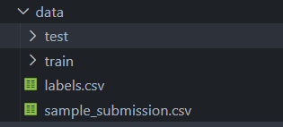

DATASET USED : https://www.kaggle.com/competitions/dog-breed-identification/data

STEPS:
1	download dataset
2	create folder named data in program directory

3	extract files from downloaded data to 'data' folder, shown like below

4	do 'pip install -r requirements.txt'

5	run main.ipynb
